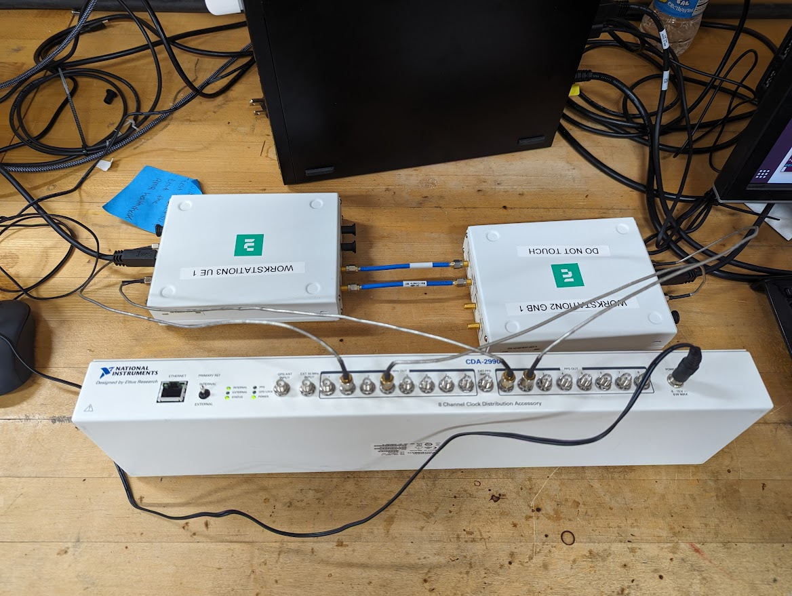
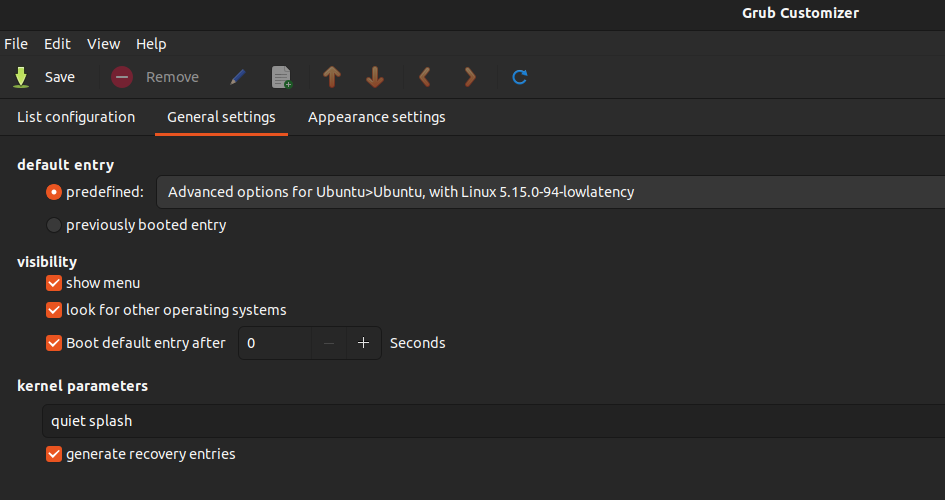
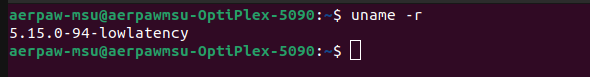
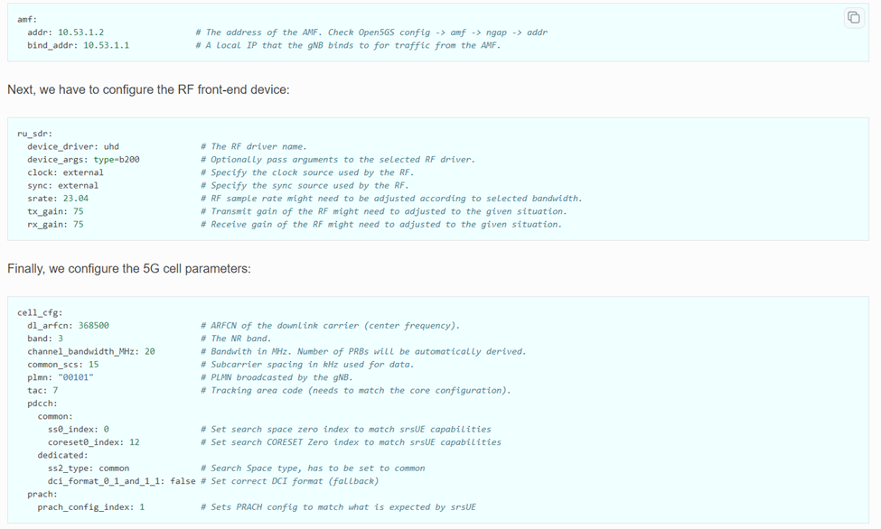
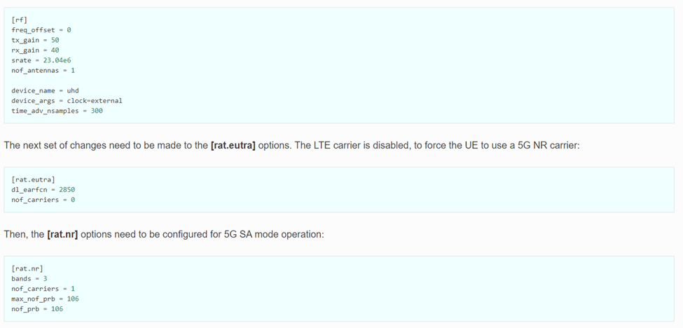
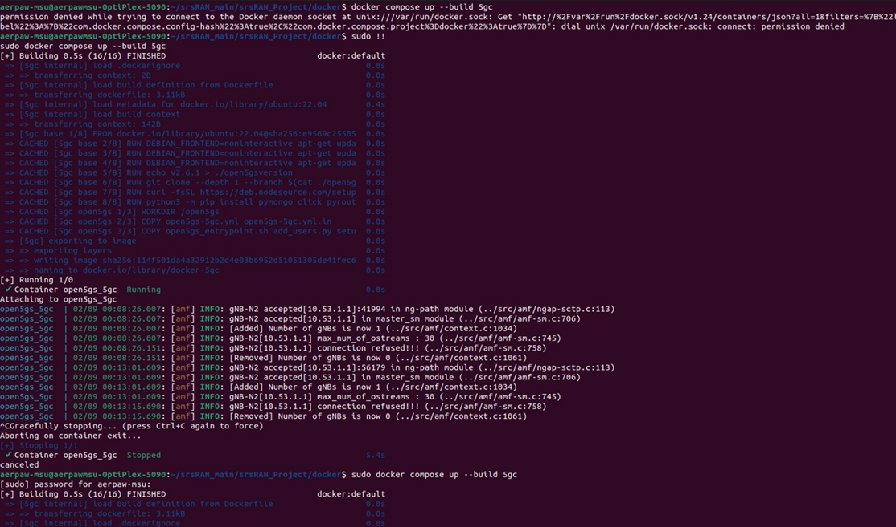
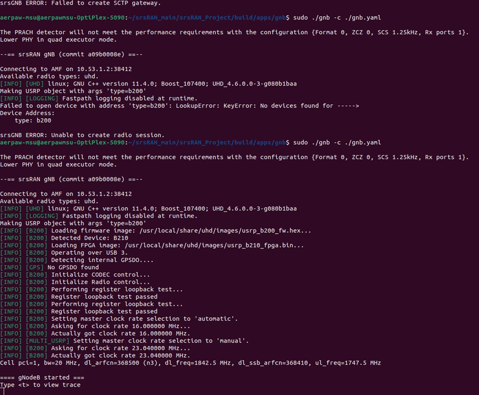
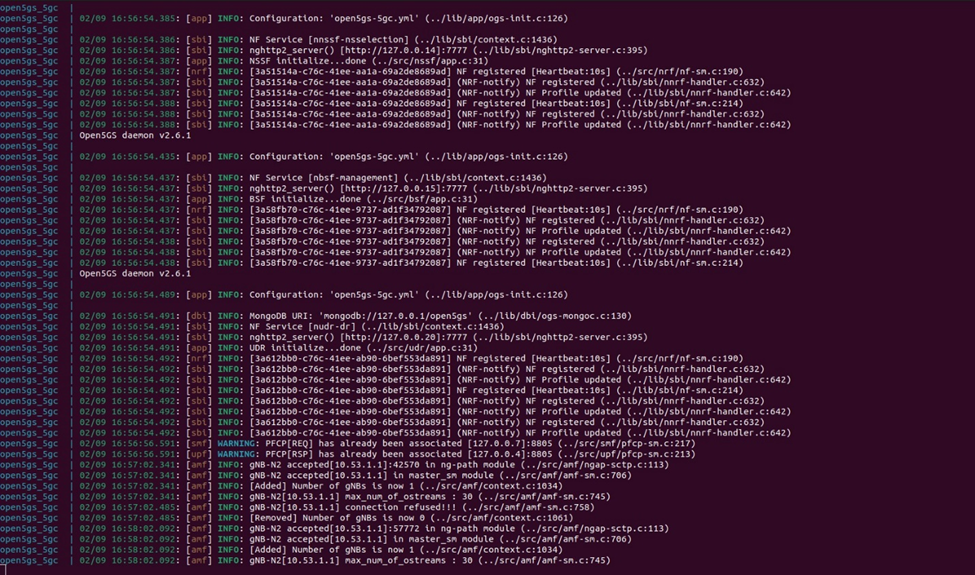
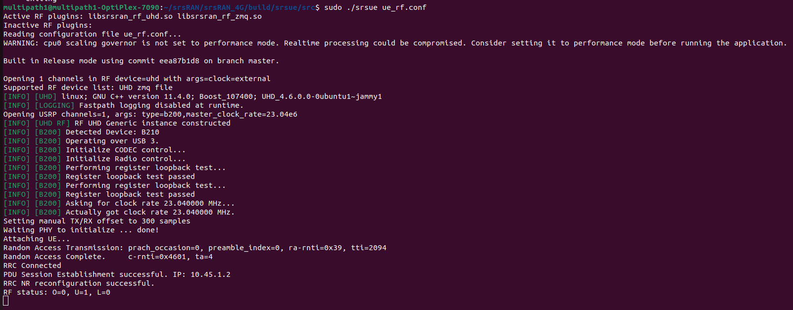

# Homepage
 
For full documentation visit [mkdocs.org](https://www.mkdocs.org).

## Installation
To install srsRAN, please follow steps as mentioned here: https://joshuamoorexyz.github.io/projects/installation/

## srsRAN Setup of Over The Air 
 After installation, please follow the following steps:

 1. Setting up hardware 

 2. Installation of Low Latency Kernel and Setting it up as default terminal
 
 3. Downloading The Required gNb and UE files
 
 4. Running the srsRAN Setup

 5. Using Iperf to Check Quality of Signal
### 1. Setting up hardware
    
1. 2 pc’s working in low latency kernel (System A: CN & gNb & System B: UE)
2. 2 USRPs B210 (make sure you connect them to USB 3.0 port)
3. Octoclock 
4. SMA wires or antennas
    
Connect them as shown in picture:


    
### 2. Installation of Low Latency Kernel

 If your default terminal is not low latency, please follow the below. Otherwise, you can skip it.
 You can check whether you have low latency terminal by running:
``` bash
uname -r
```
 
#### Installation of Low Latency Kernel

``` bash
sudo apt-get update 

sudo apt-get install linux-lowlatency linux-headers-lowlatency
```

Please `reboot` your system.
   
#### Setting up Low Latency as Default 

``` bash
sudo add-apt-repository ppa:danielrichter2007/grub-customizer
sudo apt-get update
sudo apt-get install grub-customizer
```
Open the grub customizer from search bar and set default terminal as lowlatency inside default entry under General settings as shown below.



You can verify whether you have low latency terminal by using `uname -r`.



### 3. Downloading the required config files

#### Downloading the gNb files:
On system A,please download the required config file from this link: https://github.com/srsran/srsRAN_Project/blob/main/configs/gnb_rf_b210_fdd_srsUE.yml

After downloading it, rename it to gnb.yaml, please put it following directory:
``` bash
~/srsRAN_main/srsRAN_Project/build/apps/gnb
```
#### Making required changes in gNb config file

In config file, make changes as shown in below picture:



#### Downloading the UE file
On system B, please download the required config file for UE from this link: https://docs.srsran.com/projects/project/en/latest/_downloads/900a04eeabbe80c1bb9f3e571afaa804/ue_rf.conf

After downloading, rename it to ue_rf.yaml, put it in following directory:
``` bash
~/srsRAN_main/srsRAN_4G/build/srsue/src
```
#### Making required changes in UE config file

In config file, make changes as shown in below picture:



### 4. Running The Setup

#### Running the Core Network (on System A)

``` bash
cd ~/srsRAN_main/srsRAN_Project/docker
sudo docker-compose up --build 5gc
```
The console output should be similar to this:



#### Running the gNb (on System A)

We run gNB directly from the build folder (the config file is also located there) with the following command:

``` bash
cd ~/srsRAN_main/srsRAN_Project/build/apps/gnb
sudo ./gnb -c ./gnb.yaml
```
The console output should be similar to this:



The Connecting to AMF on 10.53.1.2:38412 message indicates that gNB initiated a connection to the core. If the connection attempt is successful, the following will be displayed on the Open5GS console:



Now we can see that the gNB is now 1 on the 5gc console.

#### Running UE (on System B)

Finally, we start srsUE. This is also done directly from within the build folder, with the config file in the same location:

``` bash
cd ~/srsRAN_main/srsRAN_4G/build/srsue/src
sudo ./srsue ue_rf.conf
```

If srsUE connects successfully to the network, the following (or similar) should be displayed on the console:



### 5. Using Iperf to Check Quality of Signal (On System B)

#### On System B, using iperf
Without disturbing the UE terminal, open another terminal and run the following command:

``` bash
sudo ip route add default via 10.45.1.1 dev tun_srsue
```

Now, open another terminal to run iperf3 to see the output:

``` bash
iperf3 -c 10.53.1.1 -i 1 -t 60
```
#### On System A, using iperf

``` bash
iperf3 -s -i 1
```


